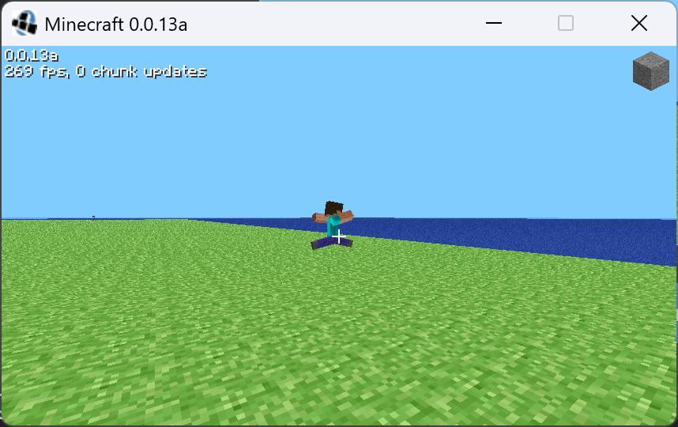

# Minecraft Version Extended
This repo contains a set of official Minecraft Versions which are not included on the official manifest. That means most Minecraft Launchers can not find them and run them.

 main page")

## Where?
Jeb_'s Reddit(Combat test) & archive.org.

## Versions Index
|Version Name|File Name|url
|:-----------|:-------:|--:|
|Combat Test 8c|1_16_combat-6.json|[Reddit](https://www.reddit.com/r/minecraftnews/comments/ih501x/combat_test_snapshot_8c_is_now_available_to/)
|Combat Test 8b|1_16_combat-5.json|[Reddit](https://www.reddit.com/r/Minecraft/comments/idvujw/here_we_go_again_combat_test_snapshot_8b/)
|Combat Test 7c|1_16_combat-3.json|[Reddit](https://www.reddit.com/r/Minecraft/comments/i9kdfh/combat_test_snapshot_version_7c/)|
|Combat Test 6|1_16_combat-0.json|[Reddit](https://www.reddit.com/r/Minecraft/comments/i5cvlh/combat_test_version_6/)
|Combat Test 5|1_15_combat-6.json|[Reddit](https://www.reddit.com/r/Minecraft/comments/epy4hv/experimental_combat_snapshot_version_5/)
|Combat Test 4|1_15_combat-1.json|[Reddit](https://www.reddit.com/r/Minecraft/comments/e3gt34/since_doing_something_this_the_last_minute_on_a/)
|Combat Test 3|1_14_combat-3.json|[Reddit](https://www.reddit.com/r/Minecraft/comments/dq2v7o/updated_combat_test_snapshot_number_3_and_a/)
|Combat Test 2|1_14_combat-0.json|[Reddit](https://www.reddit.com/r/Minecraft/comments/cqnp5b/update_custom_java_edition_snapshot_to_test_new/)
|Combat Test|1_14_combat-212796.json|[Reddit](https://www.reddit.com/r/Minecraft/comments/c5mqwv/a_custom_java_edition_snapshot_to_test_new_combat/)
|Survival Test[^1]|survivaltest/||
|c0.023a_01|c0.0.23a_01/|[archive.org](https://archive.org/details/c0.0.23a_01)|
|A LOT OF VERSIONS[^2]|...|...|[archive.org](https://archive.org/details/minecraftjavaeditionarchive)

## How to use?
1. Find a version if `Versions` folder.
2. Move the folder into `.minecraft` or `.minecraft/versions`
3. ~~Download the files of the version using your launcher using `Repair Files`(补全文件 in Chinese).~~(Just click Launch and your launcher should do it automatically.)
4. Enjoy it.
If it still fail to launch, you should download the jar manually, from the `"downloads"` key in your `version.json`. Save with the same name of your json (abc.json+abc.jar in the same folder). And Disable the file check of the launcher. You can add a issue since this is probably my fault...

We also provide a [version_manifest.json]("https://raw.githubusercontent.com/HPLAY-dev/minecraft-archive/blob/main/version_manifest.json") with the versions included. Inside this `.json` file, `version.json` are modified in order to make launchers know where to download the `client.jar` file.

## How to add? (Standard)
Copy the jar file into `Versions/${ID}`, add the ID's `version.json`(from similar versions), change `id` `downloads.client&sha1&size`(use script sha1.ps1).

[^1]: Unfortunately, this file is hard to be found. So that I've downloaded it on [indiedb.com](https://www.indiedb.com/games/minecraft/downloads/minecraft-survival-test-030-2018-edition). Although I've checked, you still need to be careful using it.
[^2]: Although MOJANG uploaded the builds of many Minecraft ancient versions. They didn't upload their `version.json`. You may need to use some nearby versions'`version.json` in order to launch these versions. I will try to make some of the versions runable by making jsons.